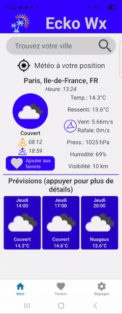
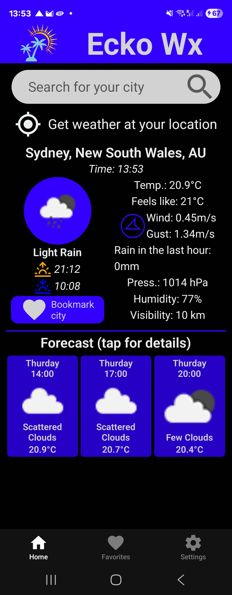

# The Ecko_Wx weather app

Written in react native, using the [Open Weather API](https://openweathermap.org/).
You will need your API KEY from Open Weather.

## Features

- Search cities by name
- Use your GPS-location to see weather where you are
- Access current weather or 5-days forecast
- Save your favorite cities for quick access
- Remove a favorite city
- Choose your unit of temperature (Celsius or Farenheit)
- Choose English, French or Swedish as a display language

### DEMO VIDEO & DARK MODE EXAMPLE

<!-- prettier-ignore-start -->


<!-- prettier-ignore-end -->

## Run it on your phone with the Expo Go app

this app is not published on any App-store. you can test it on your mobile with the Expo Go app ([Google Play](https://play.google.com/store/apps/details?id=host.exp.exponent&hl=en_US) or [App Store](https://apps.apple.com/us/app/expo-go/id982107779)).
Run a terminal within the project folder and type:

```jsx
npx expo start
```

A QR-code will appear in the terminal, scan it with the app.
You should be running the app on your phone.

## Run it in your browser

Run a terminal within the project folder and type:

```jsx
npx expo start
```

click on the localhost link that appears.

Since this project is meant for mobile use, GPS-functionality will not work, however some browsers may use your IP-address.

**For better result;** run the app in mobile mode. For most browser press F12 and select the mobile icons. This will activate mobile mode. Depending on your browser, a selection of phone should be available in the top part of the screen.

## Comments to

E-mail: [eckofox1981pm.me](mailto:eckofox1981pm.me) (be nice ;-) ).
